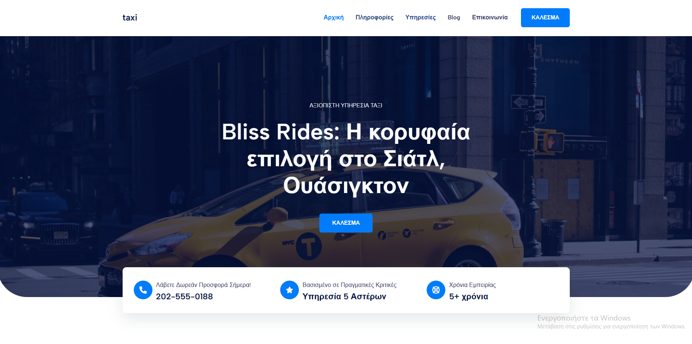
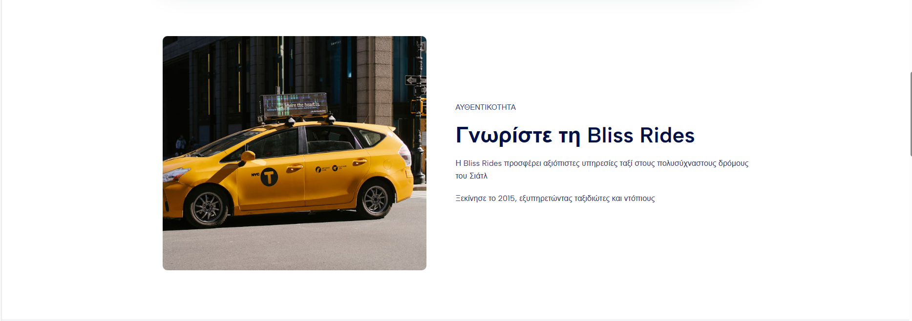
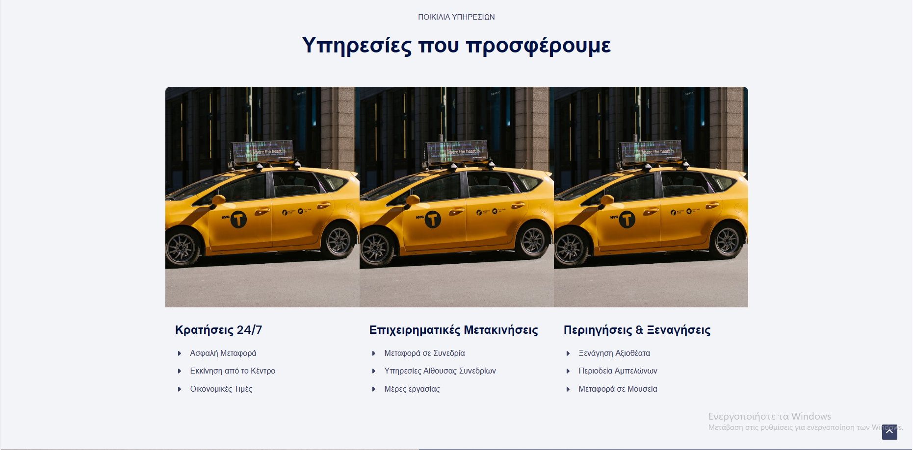
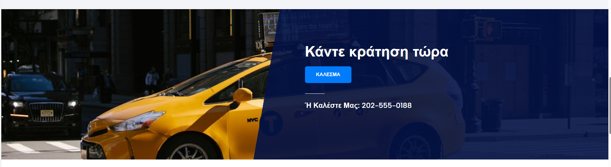
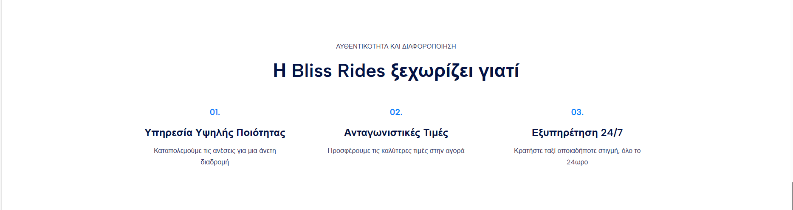
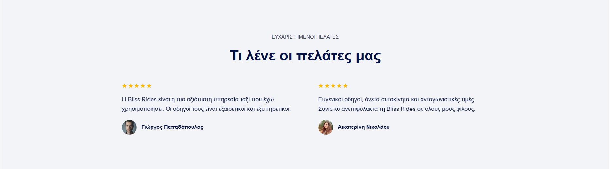
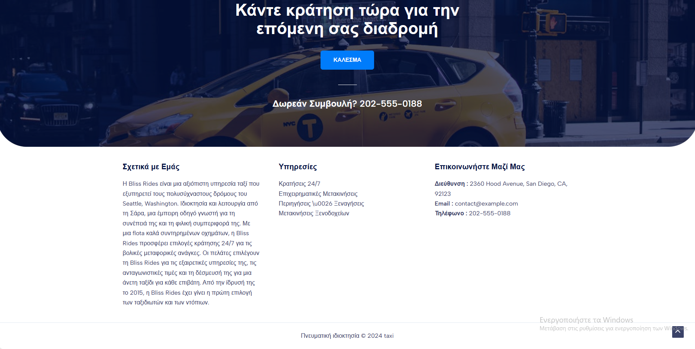
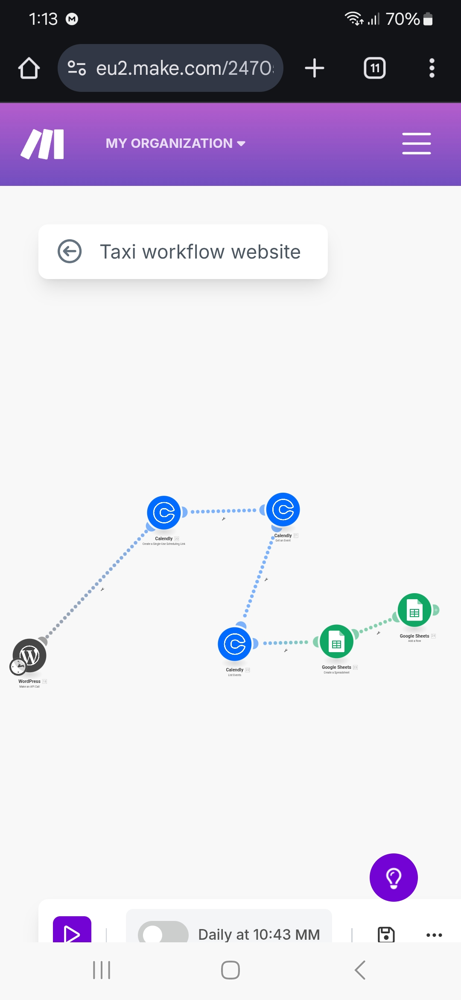

# Taxi-Booking-Workflow 
is a booking system that allows customers to directly to book a call from the website of the driver and the driver receive details about the customers booking information to use their services.

It was made using WordPress for the website and Make.com for the booking workflow.

## Resources 
Make: https://www.make.com/en
WordPress: https://wordpress.org/

## Taxy Booking Website

## Taxi Booking Workflow 

